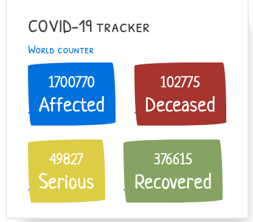

# COVID-19-Global-tracker

Simple COVID tracker made using [PaperCSS](https://www.getpapercss.com/), [Vuejs](https://vuejs.org) and [CoronaVirus-19-api](https://github.com/javieraviles/covidAPI)

## Installation

No installation needed, just open the `index.html` in the browser and that's it.

## Preview

## Contributing
Pull requests are welcome. For major changes, please open an issue first to discuss what you would like to change.

## License
[MIT](https://choosealicense.com/licenses/mit/)
